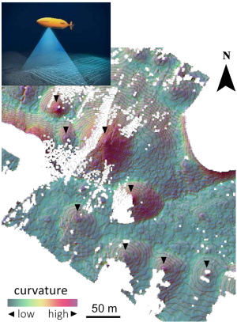
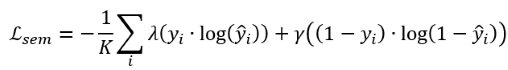

# 3D point cloud object detection in surface models via Graph Convolutional Networks (GCNs) and Voting module
  <br>

## Context
Future maritime operations will require mapping and describing the seafloor at high precision. On this basis, 
this project aims to detect 3D objects from point cloud sonar data (e.g., geological mounds with
specific geometries). Terrain information is captured via AUV echo-sounders (bathymetry), then processed via GIS 
software. 

|                                                                                                                                                                                                                                            |
|:---------------------------------------------------------------------------------------------------------------------------------------------------------------------------------------------------------------------------------------------------------------------------------:|
| Map-view examples of RGB-projected topographic curvature (shaded, 1-m resolution) resulting from principal component analysis. Annotated structures correspond to convex-type mounds (objects of interest). Inlet picture shows an AUV collecting terrain data via echo-sounding. |

## About data
Chunks of the high-resolution bathymetry data collected were extracted according to regions delineated via GIS, 
for training purposes, i.e. individual chunks are single training 3D point clouds fed to the network (example 
shown in the above figure, with 8 objects of interest). Because the point cloud is generally too dense, they must
be down-sampled (see below figure).

|                                                                                                                                                         |
|:----------------------------------------------------------------------------------------------------------------------------------------------------------------------------------------------------:|
|                Down-sampling of a training point cloud using grid cells. Individual points are randomly sampled from every cell. The cell size modulates the extent of sub-sampling.                 |

To help our algorithm learn from vertex coordinates, we rescale a vertex $x_i$ with 3D coordinates as:


## About the algorithm
This algorithm allows recognizing 3D objects directly from point clouds using XYZ information. Terrain geometry is first captured via 
graph convolutional networks (backbone), then a voting and proposal module generates boxes with given dimensions and 
orientation, at estimated object centroids (votes) - the module is implemented in a similar fashion than proposed in 
[VoteNet](https://openaccess.thecvf.com/content_ICCV_2019/papers/Qi_Deep_Hough_Voting_for_3D_Object_Detection_in_Point_Clouds_ICCV_2019_paper.pdf).

|                                                                                                                                                                                                                                                                                                                                                                                                                                                                                                                      |
|:-------------------------------------------------------------------------------------------------------------------------------------------------------------------------------------------------------------------------------------------------------------------------------------------------------------------------------------------------------------------------------------------------------------------------------------------------------------------------------------------------------------------------------------------------------------------------------:|
| The suggested detection framework with a pyramid graph (backbone) network pooling and up-sampling graphs. The generated seeds consist of n points with C features plus 3 coordinates. Multilayer perceptrons (MLP) estimate object centers (votes) and semantic classes separately. The proposal module is a sub-network calculating m foreground bounding boxes (m≤n). Next, the proposals are clustered into k groups given the object centers. Finally, we obtain k 3D bounding boxes after applying a non-maximum-suppression (NMS) to each clustered proposal iteratively. |

Assuming $n_pos$ the number of foreground points in a batch, and K the batch size, the 3D boxes can be estimated 
using:

* **(1) the regression loss**: assuming $n_pos$ the number of foreground points in a batch, and K the batch size


where Φ is the Huber loss (smooth-L1) with 1 indicating whether a seed point $s_i$ relates to an object. The 
weight factor β is a vector with positive constants balancing the relative importance of regression losses
when predicting $û_i$.

* **(2) the center loss**: 


where $c_i^q$ and $c ̅_i^q$ are the estimated and average ground truth center coordinates for a node i and an object q, 
and M is the number of nodes constituting an object q. 

* **(3) the semantic loss**: to ensure that the network concentrates on hard samples (foreground) during the training process



where $y_i$ and $y ̂_i$ represent ground truth and prediction respectively, K the batch size and λ and γ represent 
factors solving the class imbalance in segmentation task. 

## About the results
Detection performance on 3D dataset is challenging due to the imprecise geometry of natural objects (geological mounds) i.e. 
the spatial continuity, as well as the angularity, circularity, width and height, of such objects vary significantly.

**Example of training curves for total loss (left) and f1 metric (right) for semantic segmentation:**


**Example of boxes predicted:**


## Usage
Run with Python console, e.g. the train module:
```python
python train.py --gpu_memory 0.2 --gpu_device 1 --model_folder model_001
```
The above-witten options give you possibilities to limit the usage of GPU memory up to 20% for this training, 
considering the GPU device 1 (if your infrastructure consists of 2 or more GPUs). Variables of the previously 
trained model `model_001` are restored.

Running the _predict_ module will generate and display boxes for a given point cloud data folder:
```python
python predict.py --data_folder folder_001 --semantics_only True
```
If the option `--semantics_only` is set, only semantic segmentation of the point cloud will be generated.
